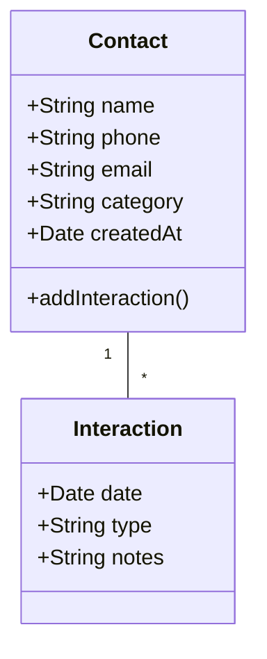

# Контакты-приложение

Приложение для управления контактами с расширенными возможностями поиска и категоризации.

## ⚙️ Функционал
- ✅ Добавление/редактирование/удаление контактов
- ✅ Группировка контактов по категориям (клиенты, коллеги, друзья)
- 🔍 Продвинутый поиск с фильтрацией по тегам
- 📥 Импорт/экспорт контактов (CSV, JSON)
- 📋 История взаимодействий с каждым контактом

## 🚀 Установка
```bash
git clone https://github.com/yourusername/contacts-app.git
cd contacts-app
npm install
npm start
```

## 🖼️ Скриншоты
| Главный экран | Добавление контакта |
|---------------|---------------------|
|  |  |

## 🛠️ API Endpoints
```javascript
// Получение списка контактов
GET /api/contacts

// Фильтрация по категории
GET /api/contacts?category=clients

// Добавление нового контакта
POST /api/contacts
{
  "name": "Иван Иванов",
  "phone": "+79991234567",
  "email": "ivan@example.com",
  "category": "clients"
}
```

## 🧩 Архитектура

