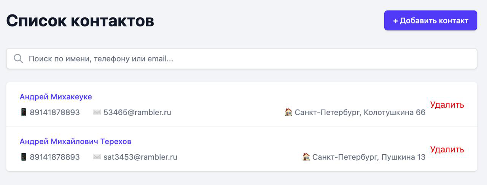

# Приложение "Список контактов"

Это приложение "Список контактов", разработанное с использованием SvelteKit, TypeScript, Tailwind CSS и Dexie для хранения данных в IndexDB.

## Краткий процесс работы с ИИ

Этот `README.md` был сгенерирован ИИ-агентом. Агент проанализировал предоставленные файлы требований (`.clinerules/01-project-requirements.md`) и технических спецификаций (`.clinerules/02-tech-specs.md`), а также файл `package.json` для получения информации о проекте и инструкций по запуску.

## Основные функции приложения

Приложение "Список контактов" предоставляет следующие возможности:

- **CRUD операции**: Создание, чтение, обновление и удаление контактов.
- **Поиск**: Быстрый поиск контактов по различным критериям.
- **Хранение данных**: Все данные контактов надежно хранятся в IndexDB с использованием библиотеки Dexie.
- **Адаптивный дизайн**: Интерфейс приложения адаптируется под различные размеры экранов (мобильные устройства, планшеты, десктопы).

## Инструкции по запуску

Чтобы запустить приложение локально, выполните следующие шаги:

1.  **Клонируйте репозиторий**:
    ```bash
    git clone https://github.com/and-trkh/contacts_app.git
    cd contacts_app
    ```
2.  **Установите зависимости**:
    ```bash
    npm install
    ```
3.  **Запустите приложение в режиме разработки**:
    ```bash
    npm run dev
    ```
    Приложение будет доступно по адресу `http://localhost:5173` (или другому порту, указанному в консоли).

## Скриншот интерфейса


